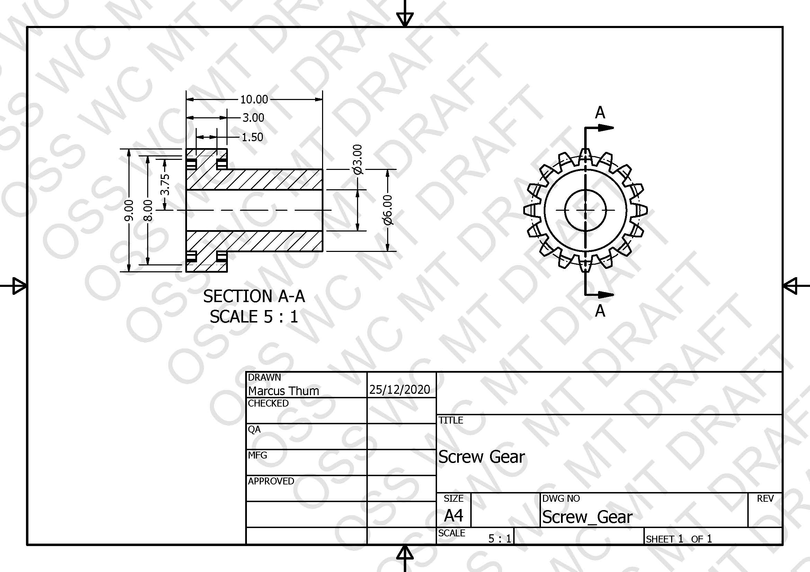

# Mechanical Video
https://drive.google.com/drive/folders/1eZKNXZl2MZ22a9SX9GnYOMj2R70lQMPq?usp=sharing

# BOM Table
> 

# BioMechenical-Thumb

> 
> 

# Mechanical Drawings
> 
> 
> 
> 
> 
> 
> 
> 
> 
> 
> 
> 
> 
> 
> 

# Mechanical Calculations

> 
> 
